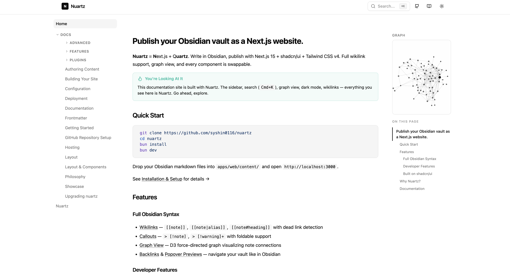

<div align="center">

# Nuartz

**Publish your Obsidian vault as a Next.js website.**

[](https://www.npmjs.com/package/nuartz)
[](https://opensource.org/licenses/MIT)

[Documentation & Demo](https://nuartz.vercel.app) · [Use Case](https://syshin0116.vercel.app/blog) · [npm](https://www.npmjs.com/package/nuartz)



</div>

Nuartz parses Obsidian-flavored markdown — wikilinks, callouts, backlinks, tags, math, graph — and gives you a polished site built with **Next.js 15**, **shadcn/ui**, and **Tailwind CSS v4**. Every component is swappable. It's just React.

Heavily inspired by [Quartz](https://github.com/jackyzha0/quartz). Quartz is an amazing project that pioneered Obsidian-to-website publishing, and Nuartz borrows many of its ideas — the difference is the stack. Nuartz runs on Next.js + shadcn/ui, so you get the full React ecosystem, copy-paste UI components from [ui.shadcn.com](https://ui.shadcn.com), and deploy anywhere Next.js runs.

## Who is this for?

- **Obsidian users** who want to publish their vault without giving up wikilinks, callouts, or graph view
- **Next.js developers** who want a blog or digital garden inside their existing app, not a separate tool
- **Quartz users** who love the concept but want more UI flexibility with React components and shadcn/ui

## How it works

Nuartz has two layers:

| Layer | What it is | How to use it |
|-------|-----------|---------------|
| **`nuartz` (npm package)** | Headless data library — markdown → HTML, file tree, wikilinks, backlinks, search index | `bun add nuartz` and wire into any Next.js app |
| **`apps/web` (starter template)** | Complete Next.js 15 app with shadcn/ui, sidebar, graph view, search, dark mode | Clone the repo and deploy |

Most people start with the starter template. If you want to embed a garden into an existing Next.js app, use the package directly.

## Features

- **Obsidian syntax** — Wikilinks (`[[page]]`, `[[page|alias]]`, `[[page#heading]]`), callouts, inline tags, `==highlights==`, `%%comments%%`
- **Graph view** — Interactive D3 force-directed graph, just like Obsidian
- **Full-text search** — `Cmd+K` powered by FlexSearch with CJK support
- **Backlinks & popover previews** — Navigate your vault like in Obsidian
- **Dark mode** — System-aware theme switching
- **Math & code** — KaTeX for equations, Shiki for syntax highlighting
- **SEO-ready** — Dynamic OG images, RSS feed, sitemap, dead link detection
- **Extras** — Table of contents, reader mode, Giscus comments, draft filtering

## Quick Start

```bash
git clone https://github.com/syshin0116/nuartz
cd nuartz
bun install
bun dev
```

Put your Obsidian markdown files in `apps/web/content/` and open `http://localhost:3000`.

## Deploying

Nuartz supports two deployment modes. Pick the one that fits your needs:

### GitHub Pages (free, static)

All pages are pre-built as static HTML at build time. No server needed.

1. Go to your repo's **Settings > Pages**, set source to **GitHub Actions**
2. Add `push` trigger to `.github/workflows/deploy-pages.yml` (it's manual-only by default)
3. Push to `main` — the workflow builds and deploys automatically

No `next.config.ts` changes needed. The workflow automatically enables static export during CI.

What works: search, graph view, popover previews (internal links), dark mode, tags, backlinks, RSS, sitemap — everything that can be computed at build time.

What doesn't: dynamic OG images (per-page social cards), external link previews, Next.js image optimization. These features need a server.

### Vercel (recommended, server-side)

Import the repo in Vercel with these overrides:

| Setting | Value |
|---------|-------|
| Root Directory | `apps/web` |
| Install Command | `cd ../.. && bun install --frozen-lockfile` |
| Build Command | `cd ../.. && bun run build:pkg && cd apps/web && next build` |

Everything works, including dynamic OG images and external link previews. Free tier is generous enough for most personal sites.

See the [full hosting guide](apps/web/content/docs/hosting.md) for Netlify, Docker, and details on what each mode supports.

## Using as a Package

```bash
bun add nuartz
```

```typescript
import {
  renderMarkdown,      // string -> { html, frontmatter, toc, links, tags }
  buildBacklinkIndex,  // build slug -> backlinks map
  buildFileTree,       // flat file list -> nested tree
  buildSearchIndex,    // files -> search-ready entries
  defineConfig,        // typed config helper
} from "nuartz"
```

## Stack

| Layer | Technology |
|-------|-----------|
| Framework | Next.js 15 (App Router) |
| UI | shadcn/ui + Radix UI |
| Styling | Tailwind CSS v4 |
| Markdown | unified / remark / rehype |
| Graph | D3 force-directed |
| Runtime | Bun |

## Acknowledgements

Nuartz stands on the shoulders of [Quartz](https://github.com/jackyzha0/quartz) by [@jackyzha0](https://github.com/jackyzha0). The project's approach to Obsidian syntax parsing, graph visualization, and overall UX are directly inspired by Quartz. If you want a battle-tested solution that works out of the box, Quartz is an excellent choice — Nuartz simply brings those ideas into the Next.js ecosystem for developers who want React-level customization.

## Showcase

> Using Nuartz? Open a PR to add your site here!

| Site | Description |
|------|-------------|
| [syshin0116.vercel.app/blog](https://syshin0116.vercel.app/blog) | Personal blog and digital garden |

## License

MIT
