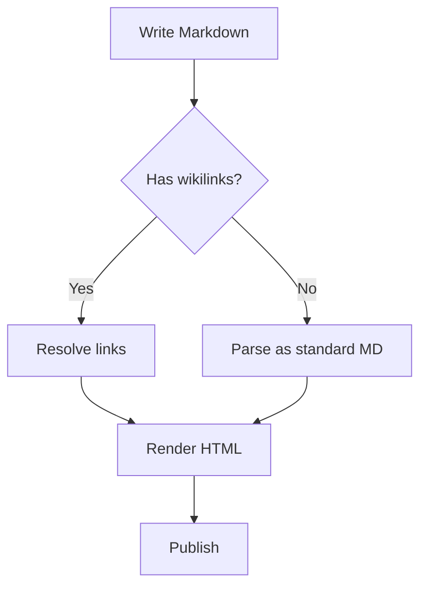
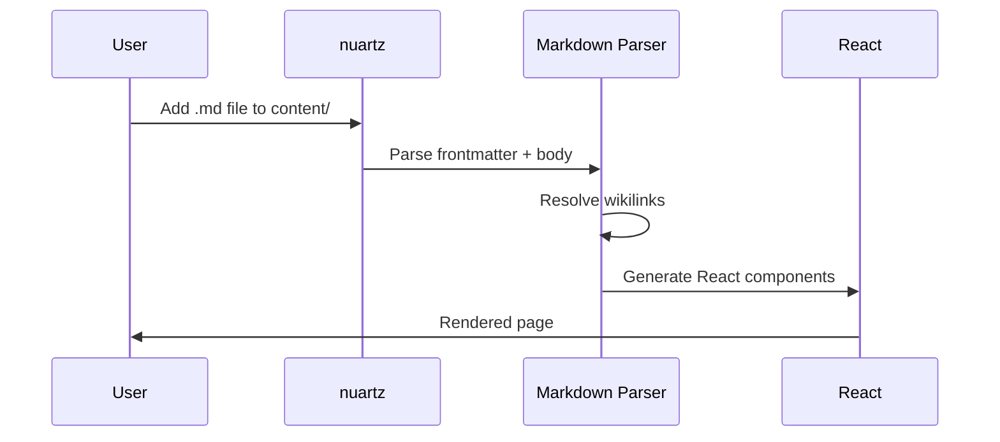
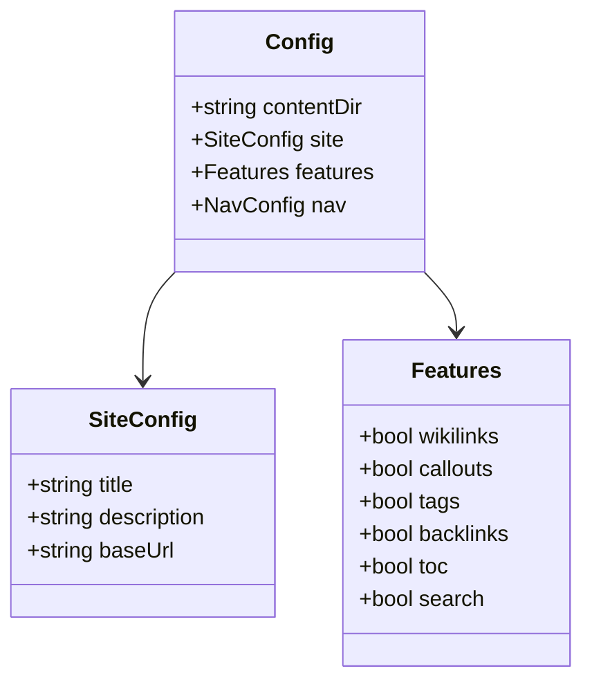
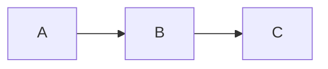

nuartz renders [Mermaid](https://mermaid.js.org/) diagrams directly from code blocks. Create flowcharts, sequence diagrams, class diagrams, and more using simple text syntax.

## Flowchart



## Sequence Diagram



## Class Diagram



## Syntax

Use a fenced code block with the `mermaid` language:

````markdown

````

> [!tip] Mermaid Live Editor
> Use the [Mermaid Live Editor](https://mermaid.live/) to prototype your diagrams before adding them to your notes.

> [!note] Theme Matching
> Mermaid diagrams automatically adapt to nuartz's light/dark theme.

## Related

- [[docs/features/syntax-highlighting|Syntax Highlighting]] — code block rendering
- [[docs/authoring-content|Authoring Content]] — full content writing guide
- [[docs/configuration|Configuration]] — enable/disable features
